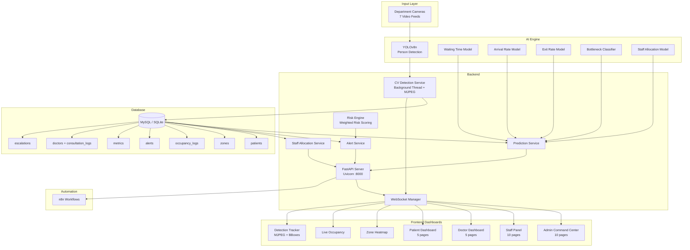

# PatientPath AI

### Real-Time Hospital Flow & Resource Optimization Platform

**An AI-Powered Digital Twin for Intelligent Hospital Operations Management**

---

## Executive Summary

Hospitals worldwide face critical operational challenges: overcrowded waiting rooms, invisible bottlenecks, reactive staffing, and fragmented patient tracking. These inefficiencies lead to prolonged patient wait times, staff burnout, and suboptimal resource utilization.

**PatientPath AI** is a real-time Digital Twin platform that mirrors live hospital operations through an integrated stack of Computer Vision, Machine Learning, and WebSocket-driven communication. The system ingests live video feeds from seven hospital departments, detects and counts patients using YOLOv8n, predicts operational bottlenecks with XGBoost models, and pushes actionable intelligence to role-specific dashboards within seconds.

The result: hospital administrators move from reactive firefighting to proactive orchestration, with AI-driven decisions reducing wait times, balancing staff allocation, and maintaining smooth patient throughput across every department.

---

## Problem Statement

| Challenge | Description |
|-----------|-------------|
| **Operational Blindness** | Hospital administrators lack real-time visibility into department-level occupancy and patient flow patterns. Decisions rely on periodic manual headcounts or delayed reports. |
| **Long Waiting Times** | Without predictive tools, bottlenecks form silently. Patients accumulate in departments before staff recognize the congestion, leading to cascading delays. |
| **Resource Misallocation** | Staff deployment follows fixed schedules rather than dynamic demand. Departments oscillate between being overstaffed and critically understaffed within the same shift. |
| **Manual Tracking Inefficiency** | Paper-based or badge-scan tracking creates data gaps. Patients who move between departments without scanning are invisible to the system. |
| **Lack of Real-Time Orchestration** | No unified system connects occupancy data, predictive analytics, and staff management into a single decision loop that operates in real time. |

---

## Solution Overview

PatientPath AI functions as a **real-time Digital Twin** of hospital operations, unifying four technology layers into a continuous intelligence loop:

```
 SENSE             PREDICT            ACT              DISPLAY
   |                  |                 |                  |
YOLOv8n CV -----> XGBoost ML -----> Automated -----> Role-Based
Detection         Models            Workflows         Dashboards
   |                  |                 |                  |
Video Feeds       Bottleneck        Staff Alerts      Admin/Doctor
7 Departments     Wait Time         Reallocation      Staff/Patient
Person Counting   Arrival Rate      Threshold          Live Panels
                  Staff Optimal     Triggers
```

- **Computer Vision (YOLOv8n):** Continuously processes video feeds from seven hospital zones, detecting and counting patients without manual intervention.
- **Machine Learning Models:** Five XGBoost models predict waiting times, arrival rates, exit rates, bottleneck severity, and optimal staff allocation per department.
- **WebSocket Real-Time Layer:** Sub-second propagation of occupancy changes and alerts from backend to all connected dashboards.
- **Role-Based Dashboards:** Dedicated views for administrators, doctors, staff, and patients, each showing contextually relevant information and controls.
- **Automation Integration:** n8n workflow engine handles automated appointment booking, alert escalation, and notification dispatch.

---

## Core Features

### 1. Computer Vision Layer

#### YOLOv8n Person Detection
The system deploys a YOLOv8 Nano model (`yolov8n.pt`) trained on the COCO dataset for real-time person detection. Detection is filtered exclusively to COCO class 0 (person), ensuring only human presence is counted.

#### Multi-Department Camera Monitoring
Seven hospital departments are monitored simultaneously through dedicated video feeds:

| Zone | Video Source | Zone Type |
|------|-------------|-----------|
| Registration | `registration.mp4` | Service |
| Consultation | `consultation.mp4` | Medical |
| Diagnostics | `diagnostics.mp4` | Examination |
| Vision Lab | `vision.mp4` | Examination |
| Dilation Hall | `dilation.mp4` | Medical |
| Pharmacy | `pharmacy.mp4` | Service |
| Billing & Insurance | `billing.mp4` | Service |

#### Real-Time Occupancy Tracking
Every 5 seconds, the CV service:
1. Reads a frame from each department video feed
2. Runs YOLOv8n inference (person class only)
3. Counts detected individuals and computes average confidence
4. Updates `Zone.current_occupancy` in the database
5. Creates an `OccupancyLog` entry with detection metadata
6. Broadcasts the update via WebSocket to all connected clients

#### In-Browser Live Detection Tracker with Bounding Boxes
The **Live Video** page (`video.html`) provides an integrated detection tracker directly in the browser:
- **Detection Mode Toggle:** A toggle switch lets users switch between raw video playback and the live YOLOv8 MJPEG detection stream
- **Server-Side MJPEG Streaming:** The backend streams annotated frames via `/detection/stream/{zone_name}` with green bounding boxes around detected persons, confidence labels, zone name overlay, detected count, and a pulsing LIVE indicator at ~12 FPS
- **Real-Time Stats Panel:** When detection mode is active, a stats bar displays people count, average confidence, and model info, polling `/detection/latest` every 3 seconds
- **Graceful Fallback:** If the CV service is unavailable, an error overlay with retry option is displayed; the raw video mode remains fully functional
- **Per-Department Switching:** Users can switch between all 7 departments while in detection mode; the MJPEG stream reconnects automatically

#### Zone-Based Crowd Analytics
Each detection cycle generates structured analytics:
- **People count** per zone
- **Confidence score** (average detection confidence)
- **Entry/exit delta** (change from previous reading)
- **Timestamp** for historical trend analysis
- **Source tagging** (`cv_detection`) for audit differentiation

---

### 2. Machine Learning & Predictive Intelligence

#### Arrival Rate Prediction Model
- **Model:** XGBRegressor (`arrival_model.pkl`)
- **Purpose:** Forecasts patient arrivals for the upcoming hour
- **Input Features:** `day_of_week`, `hour`, `window`, `lag1` (previous hour count), `rolling_mean_3`, `rolling_std_3`
- **Output:** Predicted number of arrivals
- **Integration:** Feeds into dashboard forecasting widgets and peak hour calculations

#### Exit Rate Estimation Model
- **Model:** XGBRegressor (`exit_rate_model.pkl`)
- **Purpose:** Estimates patient departure rate for the current hour
- **Input Features:** `day`, `day_of_week`, `hour`, `window`, `is_peak_hour`, `is_low_hour`, `is_week_start`
- **Output:** Predicted number of exits
- **Integration:** Combined with arrival predictions for net flow analysis

#### Waiting Time Prediction Model
- **Model:** XGBRegressor (`waiting_model.pkl`)
- **Purpose:** Predicts department-specific patient wait times in minutes
- **Input Features:** `day_of_week`, `hour`, `window`, `department_code`, `current_staff`, `active_patients`
- **Output:** Estimated wait time (minutes)
- **Integration:** Displayed on patient dashboard; drives peak hour detection logic

#### Bottleneck Detection Model
- **Model:** XGBClassifier (`bottleneck_classification_model.pkl`)
- **Purpose:** Classifies bottleneck severity per department
- **Input Features:** `day_of_week`, `hour`, `window`, `department_code`, `current_staff`, `active_patients`
- **Output:** Class 0 (No Bottleneck), Class 1 (Moderate), Class 2 (Severe) with confidence
- **Integration:** Triggers alerts, drives decision support recommendations, feeds prediction dashboard

#### Staff Allocation Regression Model
- **Model:** XGBRegressor (`staff_allocation_model.pkl`)
- **Purpose:** Predicts optimal staff count per department for current conditions
- **Input Features:** `day_of_week`, `hour`, `window`, `department_code`, `active_patients`
- **Output:** Optimal staff count (rounded up)
- **Integration:** Compared against current staff to calculate deficit; triggers reallocation alerts

#### AI Risk Engine (Intelligent Alerts)
The Risk Engine (`risk_engine.py`) aggregates outputs from **all 5 ML models** per department to compute a unified risk score:
- **Weighted Risk Score (0-100):** 30% waiting time + 25% bottleneck probability + 20% arrival rate + 15% staff deficit + 10% exit rate slowdown
- **Severity Classification:** CRITICAL (score >= 70), WARNING (score >= 40), INFO (score < 40)
- **Decision Support:** Each alert includes AI-generated recommendations (e.g., "Deploy 2 additional staff to Diagnostics")
- **Endpoint:** `GET /alerts/intelligent` returns per-department risk assessments with actionable decision support items

#### Dynamic Deficit Calculation Engine
The system continuously compares ML-predicted optimal staffing against actual staff presence:

```
deficit = optimal_staff (ML prediction) - current_staff (live count)
is_bottleneck = deficit > 0
```

When a deficit is detected, the system generates staff deployment recommendations with department-specific urgency levels.

---

### 3. Workflow & Orchestration

#### Implicit Event-Driven Patient Tracking
Patient movement through the hospital is tracked via CV detection and manual stage updates. Each state transition is recorded in the patient's `action_history` (JSON array), creating a complete audit trail without requiring physical badge scans at every checkpoint.

#### Sequential Patient Journey State Machine

```
ENTERED --> WAITING --> IN_ROOM --> EXITED
   |           |           |
   +--- Zone Assignment ---+
   |           |           |
   +--- Action History ----+
```

Patient status transitions follow a defined state machine:
- **ENTERED:** Patient detected entering the facility
- **WAITING:** Patient queued in a department
- **IN_ROOM:** Patient in active consultation or examination
- **EXITED:** Patient departed the facility

#### Real-Time Status Updates
Every patient status change, zone occupancy shift, or alert creation is immediately pushed to connected clients through the WebSocket layer. No polling delay for critical operational data.

#### WebSocket Notification Engine
The WebSocket server (`/ws`) supports:
- **Topic-based subscriptions:** Clients subscribe to `occupancy`, `alerts`, or `metrics`
- **Heartbeat monitoring:** 30-second keepalive pings
- **Broadcast types:** `occupancy_update`, `alert`, `metric_update`, `staff_alert`, `staff_update`
- **Client commands:** `subscribe`, `unsubscribe`, `ping`, `get_status`

#### AI Staff Reallocation Workflow

```
1. CV Detection updates zone occupancy
2. ML Model predicts optimal staff for each department
3. System calculates deficit (optimal - current)
4. If deficit > 0:
   a. Alert generated (severity based on deficit magnitude)
   b. Decision support item created ("Deploy staff to Department X")
   c. Notification broadcast to Admin and Staff dashboards
5. Staff checks in via /prediction/staff-checkin/{department}
6. Current staff count incremented
7. Deficit recalculated
8. Dashboard updates instantly via WebSocket
```

#### Staff Check-in Logic
Staff members check into departments through the Staff Panel or API endpoint. Each check-in:
- Increments the in-memory staff counter for the department
- Triggers deficit recalculation
- Updates all connected dashboards

---

### 4. Automation Integration

#### n8n Workflow Engine
The platform supports integration with n8n for automated workflow orchestration:
- **Automated Appointment Booking:** Webhook-triggered workflows for patient scheduling
- **Alert Escalation:** Automated notification chains when critical thresholds are breached
- **API-Based Triggers:** All REST endpoints can serve as n8n webhook targets for custom automation flows

---

### 5. Dashboard & Analytics

#### Admin Command Center
The central operations hub displaying:
- Total patients, active count, average dwell time
- CV Detection model status (active/inactive, zones monitored)
- Total detected occupancy across all departments
- Per-department detection grid with color-coded severity
- Peak hour predictions
- Escalation review panel with status management
- Hourly occupancy trend (30-min intervals, past 5 hours)
- Recent activity log with CSV export capability

#### Patient Dashboard
Patient-facing view showing:
- Current department and queue position
- AI-predicted waiting time for current department
- Step-by-step journey progress through all 7 departments with ETA
- Consultation history and timestamps

#### Patient Activity History
Patient timeline page providing:
- Chronological activity log of all movements through the hospital
- PDF export via jsPDF for patient records

#### Hospital Load Status (Patient-Facing)
Real-time department load overview for patients:
- All 7 departments displayed with HIGH/MEDIUM/LOW load indicators
- Waiting times and queue sizes per department
- Uses AI models (waiting_model, arrival_model, bottleneck_model) for load classification

#### Patient Waiting Time Trend
Live chart tracking predicted waiting times:
- Chart.js real-time trend for the patient's current department
- Auto-polling updates for continuous monitoring

#### Staff Dashboard
Staff operations panel with:
- Department assignment and check-in functionality
- Patient stage update controls (register, move to next department)
- Current department occupancy
- Active patient list for assigned zone

#### Staff Activity Feed
Live activity monitoring for staff:
- Real-time feed of patient movements, department changes, and staff actions

#### AI Staff Allocation Panel
Staff-facing resource optimization:
- AI-recommended staff allocation per department
- Deficit warnings with visual indicators
- Staff check-in functionality with immediate deficit recalculation

#### Bottleneck Warnings (Staff)
Per-department AI bottleneck analysis for staff members:
- Bottleneck risk level, queue size, predicted waiting time
- AI-recommended actions for congestion mitigation

#### Patient Search
Quick patient lookup tool:
- Search by tracking ID
- Displays current stage, next department, predicted ETA

#### Escalation System
Operational issue reporting and management:
- **Staff-side:** Escalation form for reporting issues (Equipment Delay, System Error, Patient Congestion, Staff Shortage, Other)
- **Admin-side:** Escalation review panel with status filtering (OPEN/IN_PROGRESS/RESOLVED)
- Stored in `escalations` database table with full audit trail

#### Department Performance
Department-specific KPI dashboard for staff:
- Patients processed today, average service time
- Queue size, waiting time, arrival rate
- Workload level classification

#### Department Insights
Rich Chart.js analytics for staff members:
- Load gauge, queue trend, bottleneck risk
- Patient flow funnel, waiting time distribution
- Service time trend, 30-minute queue prediction

#### Doctor Dashboard
Clinical workflow interface providing:
- Doctor check-in/check-out controls
- Patient lookup by tracking ID
- Consultation start/complete workflow with notes
- Automatic patient routing to next stage on completion
- Consultation history log

#### Resource Allocation Panel
Strategic resource view showing:
- Optimal vs. current staff per department
- Staff deficit indicators
- Bottleneck severity per zone
- Staff deployment recommendations

#### Zone Heatmaps
Visual occupancy distribution across all seven departments with:
- Color-coded intensity (green/yellow/red based on capacity thresholds)
- Real-time WebSocket updates
- Capacity percentage indicators
- Warning (80%) and critical (95%) threshold markers

#### Live Occupancy Panels
Real-time total facility occupancy with:
- Aggregate people count across all zones
- Status badge (Normal/Warning/Critical)
- Historical trend indicators
- 5-second refresh cycle

#### Alerts & Notification Center
Centralized alert management with:
- Active alert list with severity filtering (Critical/Warning/Info)
- Alert types: Capacity Warning, Capacity Critical, Long Wait Time, Unusual Activity, System Error
- Acknowledge and resolve workflows
- **AI Risk Engine alerts** with weighted risk scores (0-100) and decision support recommendations

#### Peak Hour Card
Predictive indicator showing:
- Today's predicted peak hour (start/end)
- Peak department identification
- Current vs. predicted patient load comparison

#### Historical Analytics & Trend Charts
Data visualization panels including:
- Hourly occupancy trends per zone
- Entry/exit rate charts
- Dwell time distribution
- Patient flow analysis (hourly breakdown)
- Exportable CSV data for all metrics

---

### 6. Security & Access

#### Role-Based Access Control
The system implements four user roles with differentiated access:

| Role | Access Level | Dashboard | Pages |
|------|-------------|-----------|-------|
| **Admin** | Full system access, activity logs, exports, CV status, escalation review | Admin Command Center | 10 pages |
| **Doctor** | Patient lookup, consultation workflow, check-in/out, live video | Doctor Dashboard | 5 pages |
| **Staff** | Department operations, patient stage updates, check-in, bottleneck warnings, escalation reporting, department analytics | Staff Panel | 10 pages |
| **Patient** | Journey tracking, wait time prediction, hospital load status, activity history | Patient Dashboard | 5 pages |

#### Protected API Endpoints
API endpoints enforce role-based access through session validation. Administrative endpoints (activity logs, exports, system configuration) are restricted to authorized roles.

#### Password Validation Rules
The authentication system enforces strong password requirements:
- Minimum length enforcement
- Character complexity requirements
- Session management with secure storage

#### Secure Authentication Flow
User authentication follows a structured flow:
1. Role selection and credential entry
2. Session establishment with role and department assignment
3. Dashboard routing based on authenticated role
4. Session clearing on logout

---

## AI Models & Data Flow

### Model Integration Architecture

```
                    +------------------+
                    |   Video Feeds    |
                    |   (7 Cameras)    |
                    +--------+---------+
                             |
                    +--------v---------+
                    |  YOLOv8n Model   |
                    |  Person Detection|
                    +--------+---------+
                             |
                   +---------v----------+
                   | Zone.current_      |
                   | occupancy (DB)     |
                   +---------+----------+
                             |
              +--------------+--------------+
              |              |              |
    +---------v---+  +-------v-----+  +-----v---------+
    | Bottleneck  |  | Wait Time   |  | Staff Alloc.  |
    | Classifier  |  | Regressor   |  | Regressor     |
    +------+------+  +------+------+  +------+--------+
           |                |                |
    +------v------+  +------v------+  +------v--------+
    | Severity    |  | Minutes     |  | Optimal Staff |
    | 0/1/2       |  | per Dept    |  | per Dept      |
    +------+------+  +------+------+  +------+--------+
           |                |                |
           +----------------+----------------+
                            |
                   +--------v---------+
                   | Decision Engine  |
                   | Alerts + Actions |
                   +--------+---------+
                            |
                   +--------v---------+
                   | WebSocket Layer  |
                   | Real-Time Push   |
                   +--------+---------+
                            |
                   +--------v---------+
                   | Role Dashboards  |
                   | Admin/Staff/Dr   |
                   +------------------+
```

### Per-Model Detail

#### 1. Waiting Time Prediction

| Attribute | Detail |
|-----------|--------|
| **File** | `waiting_model.pkl` |
| **Algorithm** | XGBRegressor |
| **Purpose** | Predict per-department patient wait time |
| **Input** | `day_of_week`, `hour`, `window`, `department_code`, `current_staff`, `active_patients` |
| **Output** | Wait time in minutes (float) |
| **System Integration** | Displayed on Patient Dashboard; used to calculate peak hours; drives Long Wait Time alerts |
| **Decision Impact** | Patients see expected wait; admins identify slow departments; peak hour card shows today's busiest period |

#### 2. Arrival Rate Prediction

| Attribute | Detail |
|-----------|--------|
| **File** | `arrival_model.pkl` |
| **Algorithm** | XGBRegressor |
| **Purpose** | Forecast patient arrivals in the next hour |
| **Input** | `day_of_week`, `hour`, `window`, `lag1`, `rolling_mean_3`, `rolling_std_3` |
| **Output** | Predicted arrival count (integer) |
| **System Integration** | Dashboard forecasting; combined with exit rate for net flow; resource pre-positioning |
| **Decision Impact** | Enables proactive staff deployment before patient surges arrive |

#### 3. Exit Rate Estimation

| Attribute | Detail |
|-----------|--------|
| **File** | `exit_rate_model.pkl` |
| **Algorithm** | XGBRegressor |
| **Purpose** | Estimate patient departures for the current hour |
| **Input** | `day`, `day_of_week`, `hour`, `window`, `is_peak_hour`, `is_low_hour`, `is_week_start` |
| **Output** | Predicted exit count (integer) |
| **System Integration** | Net flow calculation (arrivals - exits); occupancy trend prediction |
| **Decision Impact** | Predicts when departments will clear, enabling capacity planning |

#### 4. Bottleneck Classification

| Attribute | Detail |
|-----------|--------|
| **File** | `bottleneck_classification_model.pkl` |
| **Algorithm** | XGBClassifier |
| **Purpose** | Classify department bottleneck severity |
| **Input** | `day_of_week`, `hour`, `window`, `department_code`, `current_staff`, `active_patients` |
| **Output** | Class: 0 = No Bottleneck, 1 = Moderate, 2 = Severe; with confidence percentage |
| **System Integration** | Prediction dashboard severity cards; live alert generation; decision support items |
| **Decision Impact** | Triggers "Deploy Staff" recommendations; severity-coded alerts for admin; department-level triage |

#### 5. Staff Allocation

| Attribute | Detail |
|-----------|--------|
| **File** | `staff_allocation_model.pkl` |
| **Algorithm** | XGBRegressor |
| **Purpose** | Predict optimal staff count per department |
| **Input** | `day_of_week`, `hour`, `window`, `department_code`, `active_patients` |
| **Output** | Optimal staff count (rounded up) |
| **System Integration** | Compared against current staff; deficit drives alerts; resource allocation panel |
| **Decision Impact** | Quantifies exact staffing gap per department; guides real-time reallocation decisions |

---

## Computer Vision Pipeline Architecture

### End-to-End CV Pipeline

```
+-------------------+     +------------------+     +------------------+
| Video Files       |     | YOLOv8n Engine   |     | Post-Processing  |
| (7 departments)   | --> | Inference        | --> | & Counting       |
|                   |     | (person class=0) |     |                  |
+-------------------+     +------------------+     +--------+---------+
                                                            |
                    +---------------------+        +--------v---------+
                    | MJPEG Stream        |        | Database Update  |
                    | /detection/stream/  | <----- | Zone + OccLog    |
                    | (Bounding Boxes,    |        +--------+---------+
                    |  ~12 FPS, Browser)  |                 |
                    +---------------------+        +--------v---------+
                                                   | WebSocket Layer  |
                                                   | broadcast_       |
                                                   | occupancy_update |
                                                   +--------+---------+
                                                            |
                                                   +--------v---------+
                                                   | Frontend Clients  |
                                                   | Heatmap, Occupancy|
                                                   | Admin, Detection  |
                                                   +-------------------+
```

### Pipeline Stages

**1. Video Input Handling**
- Each of the 7 hospital zones has a dedicated video file (`frontend/assets/videos/`)
- OpenCV (`cv2.VideoCapture`) opens each video stream on service startup
- Videos loop continuously: when a video ends, playback resets to frame 0
- Frame extraction occurs every 5 seconds to balance accuracy and computational load

**2. YOLOv8n Inference Process**
- Model loaded once at startup from `yolov8n.pt` (COCO-pretrained YOLOv8 Nano)
- Each frame is passed through the model with `classes=[0]` filter (person only)
- Inference runs in a dedicated background daemon thread to avoid blocking the async event loop
- Results contain bounding boxes, confidence scores, and class IDs

**3. Detection Filtering**
- Only COCO class 0 (person) detections are retained
- All other object classes are discarded at inference time
- Average confidence score is computed across all detections in the frame
- Zero-detection frames record a count of 0 with confidence 0.0

**4. Frame Processing Logic**
```python
for zone_name, cap in self._captures.items():
    ret, frame = cap.read()
    if not ret:
        cap.set(cv2.CAP_PROP_POS_FRAMES, 0)  # Loop video
        ret, frame = cap.read()
    if ret:
        results = self.model(frame, classes=[PERSON_CLASS_ID], verbose=False)
        people_count = len(results[0].boxes)
        avg_confidence = float(results[0].boxes.conf.mean()) if people_count > 0 else 0.0
```

**5. Data Transmission to Backend**
- Detection results update two database tables per cycle:
  - `zones` table: `current_occupancy` field set to detected count
  - `occupancy_logs` table: New row with count, confidence, delta, source
- Database operations use `get_db_context()` for thread-safe session management

**6. WebSocket Broadcasting to Frontend**
- After each zone update, the service schedules an async WebSocket broadcast
- Uses `asyncio.run_coroutine_threadsafe()` to bridge the background thread to the async event loop
- Broadcast payload: `{ "zone": zone_name, "count": people_count, "timestamp": ISO8601 }`
- All subscribed clients receive the update within milliseconds

**7. MJPEG Live Streaming with Bounding Boxes**
- The endpoint `GET /detection/stream/{zone_name}` provides a live annotated video stream
- Opens a dedicated `VideoCapture` per stream request (separate from background detection)
- Runs YOLOv8 inference on every frame with thread-safe model locking
- Draws green bounding boxes with confidence labels around each detected person
- Adds a semi-transparent overlay bar showing zone name and detected count
- Adds a pulsing red "LIVE" dot indicator
- Encodes frames as JPEG (quality 75) and yields MJPEG multipart frames at ~12 FPS
- Loops video automatically when it reaches the end
- The frontend `video.html` page embeds this stream via an `` tag pointing to the MJPEG URL

**8. Integration with Occupancy and Bottleneck Detection**
- Updated `Zone.current_occupancy` feeds directly into ML model inputs
- Bottleneck classifier uses `active_patients` (sourced from CV-detected occupancy)
- Staff allocation model uses the same occupancy data
- Alert thresholds trigger automatically when occupancy exceeds warning (80%) or critical (95%) levels

---

## System Architecture

### A. ASCII Architecture Diagram

```
+===========================================================================+
|                         PatientPath AI Architecture                       |
+===========================================================================+
|                                                                           |
|  +-------------+    +------------------+    +-----------------------+     |
|  | Department  |    | YOLOv8n Engine   |    | XGBoost ML Models     |     |
|  | Cameras     |--->| Person Detection |    |                       |     |
|  | (7 Zones)   |    | (Class 0 Only)  |    | - Waiting Time        |     |
|  +-------------+    +--------+---------+    | - Arrival Rate        |     |
|                              |              | - Exit Rate           |     |
|                              v              | - Bottleneck Class.   |     |
|                     +--------+---------+    | - Staff Allocation    |     |
|                     | FastAPI Backend  |<---+-----------------------+     |
|                     | (Uvicorn)        |                                  |
|                     |                  |    +-----------------------+     |
|                     | - REST API (70+) |--->| MySQL / SQLite DB     |     |
|                     | - WebSocket      |    | - patients            |     |
|                     | - CV Service     |    | - zones               |     |
|                     | - MJPEG Stream   |    | - occupancy_logs      |     |
|                     | - Prediction Svc |    | - alerts              |     |
|                     | - Risk Engine    |    | - metrics             |     |
|                     | - Alert Service  |    | - doctors             |     |
|                     +--------+---------+    | - consultation_logs   |     |
|                              |              | - escalations         |     |
|                     +--------v---------+    +-----------------------+     |
|                     | WebSocket Layer  |                                  |
|                     | Real-Time Push   |                                  |
|                     +--------+---------+    +-----------------------+     |
|                              |              | n8n Automation        |     |
|              +-------+-------+----+----+    | - Appointment Booking |     |
|              |       |       |    |    |    | - Alert Workflows     |     |
|              v       v       v    v    v    +-----------------------+     |
|  +-----------+-+ +---+----+ +----+---+ +-----+-----+ +----------+       |
|  | Admin (10)  | | Staff  | | Doctor | | Patient   | | Detection|       |
|  | - CV Status | | (10pg) | | (5pg)  | | (5 pages) | | Tracker  |       |
|  | - Heatmap   | | - Ops  | | - Clin | | - Journey | | - MJPEG  |       |
|  | - Alerts    | | - Anal | | - Hist | | - ETA     | | - BBoxes |       |
|  | - Escalate  | | - Escal| |        | | - PDF     | | - Stats  |       |
|  +-------------+ +--------+ +--------+ +-----------+ +----------+       |
|                                                                           |
+===========================================================================+
```

### B. Mermaid Architecture Diagram



### C. Data Flow Explanation

The system operates as a continuous feedback loop:

```
1. DETECTION:  Camera feeds --> YOLOv8n --> Person count per zone
2. STORAGE:    Count + confidence --> Zone table + OccupancyLog table
3. PREDICTION: Zone occupancy --> ML Models --> Bottleneck/Wait/Staff predictions
4. ALERTING:   Predictions --> Alert engine --> Threshold-based alert generation
5. BROADCAST:  Alerts + updates --> WebSocket --> All connected dashboards
6. ACTION:     Admin/Staff sees alert --> Checks in staff / reallocates resources
7. UPDATE:     Staff check-in --> Database update --> Deficit recalculation
8. FEEDBACK:   Updated staff count --> ML re-prediction --> New recommendations
```

---

## Real-World Workflow Simulation

### Scenario: Staff Shortage in Dilation Hall

The following step-by-step scenario demonstrates the complete system feedback loop:

**Step 1: AI Prediction**
The Staff Allocation model processes current conditions:
- Input: `day_of_week=6, hour=14, department_code=4 (dilation_hall), active_patients=9`
- Output: `optimal_staff = 3`

**Step 2: Database State**
Current staff in database:
- `dilation_hall.current_staff = 1`

**Step 3: Deficit Calculation**
```
deficit = optimal_staff - current_staff = 3 - 1 = 2
is_bottleneck = True (deficit > 0)
```

**Step 4: Alert Generation & Notification**
The system generates:
- Alert: "Dilation Hall - Staff Shortage: 2 additional staff needed"
- Decision Support: "Deploy additional staff to Dilation Hall. Current load: 9 patients with 1 staff."
- WebSocket broadcast pushes alert to Admin and Staff dashboards

**Step 5: Staff Action**
A staff member opens the Staff Panel, sees the shortage alert, and checks in:
```
POST /prediction/staff-checkin/dilation_hall
Response: { "department": "dilation_hall", "current_staff": 2, "message": "Staff checked in" }
```

**Step 6: Database Update**
- `dilation_hall.current_staff` incremented from 1 to 2

**Step 7: Deficit Recalculation**
```
new_deficit = 3 - 2 = 1
is_bottleneck = True (still needs 1 more)
```

**Step 8: Dashboard Update**
- All connected clients receive updated staff recommendation via WebSocket
- Resource allocation panel shows reduced deficit
- Alert severity may downgrade from critical to warning
- A second staff check-in would resolve the bottleneck entirely

---

## API Endpoints Overview

### Patient Management

| Method | Endpoint | Description |
|--------|----------|-------------|
| `POST` | `/patient/enter` | Register patient entry |
| `POST` | `/patient/exit` | Register patient exit |
| `GET` | `/patient/list` | Paginated patient list with filters |
| `GET` | `/patient/{patient_id}` | Get patient by ID |
| `GET` | `/patient/tracking/{tracking_id}` | Get patient by tracking ID (with consultation history) |
| `POST` | `/patient/movement` | Record patient zone movement |
| `GET` | `/patient/predicted-wait-time/{tracking_id}` | AI wait time prediction |
| `GET` | `/patient/waiting-trend/{patient_id}` | Time-series of predicted waiting times |
| `GET` | `/patient/eta/{patient_id}` | Journey tracker with progress steps, ETA, queue size |
| `GET` | `/patient/zone/{zone_name}` | Get patients in a zone |
| `POST` | `/patient/update-stage` | Update patient department stage |

### Zone & Occupancy

| Method | Endpoint | Description |
|--------|----------|-------------|
| `GET` | `/zones` | List all zones with occupancy |
| `POST` | `/zones` | Create a new zone |
| `POST` | `/zones/update` | Update zone occupancy from CV |
| `PUT` | `/zones/{zone_name}` | Update zone settings (capacity, thresholds) |
| `GET` | `/zones/{zone_name}` | Get zone details |
| `GET` | `/zones/summary/all` | Zone summaries for widgets |
| `GET` | `/zones/types/list` | List unique zone types |
| `DELETE` | `/zones/{zone_name}` | Soft-delete (deactivate) a zone |
| `POST` | `/occupancy/update` | Log CV occupancy reading |
| `POST` | `/occupancy/batch` | Batch update for multiple zones |
| `GET` | `/occupancy/current` | Facility-wide occupancy |
| `GET` | `/occupancy/history` | Historical occupancy data |
| `GET` | `/occupancy/hourly` | Hourly aggregated data |
| `GET` | `/occupancy/trend/{zone_name}` | Zone trend analysis |
| `GET` | `/occupancy/latest/{zone_name}` | Most recent occupancy reading |
| `GET` | `/occupancy/peak-heatmap` | Peak hour heatmap (day-of-week x hour) |

### AI Predictions

| Method | Endpoint | Description |
|--------|----------|-------------|
| `GET` | `/prediction/forecast` | AI forecast with time-windowed predictions and decision support |
| `GET` | `/prediction/bottleneck` | Bottleneck severity per department |
| `GET` | `/prediction/average-wait` | Predicted avg dwell time |
| `GET` | `/prediction/arrival-rate` | Next-hour arrival forecast |
| `GET` | `/prediction/exit-rate` | Current-hour exit estimate |
| `GET` | `/prediction/peak-hours/today` | Today's peak hour prediction |
| `GET` | `/prediction/live-alerts` | AI-generated live alerts |
| `GET` | `/prediction/staff-recommendation` | Staff recommendations (all) |
| `GET` | `/prediction/staff-recommendation/{dept}` | Staff recommendation (dept) |
| `POST` | `/prediction/staff-checkin/{dept}` | Staff check-in |

### Staff Allocation & Analytics

| Method | Endpoint | Description |
|--------|----------|-------------|
| `GET` | `/analytics/staff-recommendation` | All departments staff recommendations (WebSocket broadcast) |
| `GET` | `/analytics/staff-recommendation/{dept}` | Per-department AI staff recommendation |
| `POST` | `/analytics/staff-checkin/{dept}` | Check in staff, broadcast updated status |

### Alerts & Metrics

| Method | Endpoint | Description |
|--------|----------|-------------|
| `POST` | `/alerts/create` | Create alert manually |
| `GET` | `/alerts/active` | Active alerts with severity/zone filters |
| `GET` | `/alerts/summary` | Alert count by severity |
| `GET` | `/alerts/intelligent` | AI Risk Engine alerts with risk scores and decision support |
| `POST` | `/alerts/acknowledge` | Acknowledge an alert |
| `POST` | `/alerts/resolve` | Resolve an alert |
| `GET` | `/alerts/{alert_id}` | Get alert details |
| `GET` | `/alerts` | List all alerts (including resolved) |
| `GET` | `/metrics/live` | Real-time facility metrics |
| `GET` | `/metrics/dashboard` | Comprehensive analytics |
| `GET` | `/metrics/history` | Historical aggregated metrics |
| `GET` | `/metrics/flow` | Patient flow analysis (hourly entry/exit) |
| `GET` | `/metrics/zone/{zone_name}` | Zone-specific analytics |
| `GET` | `/metrics/peak-hours` | Historical peak hours |
| `POST` | `/metrics/calculate` | Manually trigger metric calculation |

### Doctor Workflow

| Method | Endpoint | Description |
|--------|----------|-------------|
| `POST` | `/doctor/check-in` | Doctor check-in (status: ONLINE) |
| `POST` | `/doctor/check-out` | Doctor check-out (status: OFFLINE) |
| `POST` | `/doctor/consult/start` | Start consultation, moves patient to consultation zone |
| `POST` | `/doctor/consult/complete` | Complete consultation, route patient to next stage |
| `GET` | `/doctor/status/{doctor_id}` | Get doctor status |

### Hospital & Staff Operations

| Method | Endpoint | Description |
|--------|----------|-------------|
| `GET` | `/hospital/load-status` | Real-time load level (HIGH/MEDIUM/LOW) for all 7 departments |
| `GET` | `/staff/bottleneck-warning/{staff_id}` | AI bottleneck warning for staff member's department |
| `GET` | `/staff/patient-search/{patient_id}` | Quick patient search with workflow status and ETA |
| `POST` | `/staff/escalate-issue` | Submit operational escalation report |
| `GET` | `/staff/escalations` | List escalation reports |
| `GET` | `/staff/department-performance/{staff_id}` | Department KPIs (processed, service time, queue, arrivals) |
| `GET` | `/staff/department-charts/{staff_id}` | Rich chart data (load gauge, queue trend, bottleneck risk, flow funnel) |
| `GET` | `/staff/waiting-distribution/{staff_id}` | Wait time distribution (0-5, 5-10, 10-20, 20+ min) |
| `GET` | `/staff/queue-trend/{staff_id}` | Queue movement trend (30-min intervals, past 5 hours) |
| `GET` | `/staff/patient-processing-rate/{staff_id}` | Hourly patient processing rate |
| `GET` | `/staff/department-status/{staff_id}` | Compact department status widget |

### Admin Operations

| Method | Endpoint | Description |
|--------|----------|-------------|
| `GET` | `/admin/activity` | Recent activity logs |
| `GET` | `/admin/export` | Export activity logs as CSV |
| `GET` | `/admin/dashboard-stats` | Aggregated stats (active patients, zone distribution) |
| `GET` | `/admin/escalations` | List escalation reports with status filter |
| `GET` | `/admin/hourly-occupancy` | 30-min interval occupancy for past 5 hours |

### CV Detection & System

| Method | Endpoint | Description |
|--------|----------|-------------|
| `GET` | `/detection/status` | CV model status and zone counts |
| `GET` | `/detection/latest` | Latest per-zone detections |
| `GET` | `/detection/stream/{zone_name}` | Live MJPEG stream with bounding boxes (~12 FPS) |
| `WebSocket` | `/ws` | Real-time event stream |
| `GET` | `/ws/status` | Active connection count |
| `GET` | `/status` | System health check |
| `GET` | `/cache/stats` | Cache hit/miss statistics |
| `POST` | `/cache/clear` | Clear all cached data |

### Data Export

| Method | Endpoint | Description |
|--------|----------|-------------|
| `GET` | `/export/occupancy/csv` | Export occupancy logs to CSV |
| `GET` | `/export/patients/csv` | Export patient records to CSV |
| `GET` | `/export/metrics/csv` | Export aggregated metrics to CSV |

### Sample API Responses

**GET /detection/latest**
```json
{
  "zones": {
    "registration": {
      "count": 8,
      "confidence": 0.697,
      "timestamp": "2026-02-22T15:06:53.434411"
    },
    "consultation": {
      "count": 8,
      "confidence": 0.697,
      "timestamp": "2026-02-22T15:07:05.601189"
    },
    "diagnostics": {
      "count": 9,
      "confidence": 0.689,
      "timestamp": "2026-02-22T15:07:21.134108"
    }
  },
  "running": true,
  "timestamp": "2026-02-22T15:07:32.890188"
}
```

**GET /prediction/bottleneck**
```json
{
  "predictions": [
    {
      "department": "Registration",
      "zone_name": "registration",
      "classification": "No Bottleneck",
      "class_id": 0,
      "confidence": "99.8%",
      "severity": "normal",
      "active_patients": 8,
      "staff_count": 2
    },
    {
      "department": "Diagnostics",
      "zone_name": "diagnostics",
      "classification": "Moderate Bottleneck",
      "class_id": 1,
      "confidence": "88.6%",
      "severity": "warning",
      "active_patients": 9,
      "staff_count": 1
    }
  ],
  "decisions": [
    {
      "title": "Diagnostics - Moderate Load",
      "description": "Deploy additional staff to Diagnostics. Current load: 9 patients with 1 staff.",
      "action_label": "Deploy Staff",
      "type": "staff",
      "zone": "diagnostics"
    }
  ],
  "timestamp": "2026-02-22T15:17:09.340418"
}
```

**GET /prediction/staff-recommendation/dilation_hall**
```json
{
  "department": "dilation_hall",
  "current_staff": 1,
  "optimal_staff": 3,
  "deficit": 2,
  "is_bottleneck": true,
  "active_patients": 9,
  "timestamp": "2026-02-22T15:20:00.000000"
}
```

---

## Tech Stack

| Layer | Technology | Purpose |
|-------|-----------|---------|
| **Frontend** | HTML5, CSS3, JavaScript, Chart.js | Role-based dashboards, real-time UI, data visualization |
| **Backend** | FastAPI (Python 3.11+) | REST API, WebSocket server, service orchestration |
| **ASGI Server** | Uvicorn | High-performance async server with hot-reload |
| **Database** | MySQL 8.0 (local) / SQLite (cloud) | Persistent storage with auto-detection |
| **ORM** | SQLAlchemy | Database abstraction and query building |
| **Machine Learning** | XGBoost, Scikit-learn | 5 prediction models (`.pkl` serialized) |
| **Computer Vision** | YOLOv8n (Ultralytics) | Real-time person detection with bounding boxes |
| **Video Processing** | OpenCV (cv2) | Frame extraction, MJPEG stream generation |
| **Real-Time Layer** | WebSockets | Sub-second event broadcasting (5 message types) |
| **Automation** | n8n | Workflow automation and alert orchestration |
| **Serialization** | Joblib / Pickle | ML model persistence |
| **PDF Export** | jsPDF | Client-side PDF generation for patient activity |
| **Deployment** | Docker, Railway | Containerized deployment with health checks |

---

## Installation & Setup Guide

### Prerequisites
- Python 3.10 or higher
- MySQL 8.0 server running on `localhost:3306`
- Git

### 1. Clone the Repository

```bash
git clone <repository-url>
cd PATIENTPATH-AI
```

### 2. Create and Activate Virtual Environment

```bash
python -m venv venv

# Windows
venv\Scripts\activate

# Linux/macOS
source venv/bin/activate
```

### 3. Install Dependencies

```bash
cd backend
pip install -r requirements.txt
```

Key dependencies installed:
- `fastapi`, `uvicorn` - Web framework and server
- `sqlalchemy`, `pymysql` - Database ORM and MySQL driver
- `xgboost`, `scikit-learn`, `joblib` - ML model inference
- `ultralytics`, `opencv-python-headless` - Computer vision
- `numpy`, `pandas` - Data processing
- `websockets` - Real-time communication

### 4. Database Setup

Create the MySQL database:

```sql
CREATE DATABASE hospital CHARACTER SET utf8mb4 COLLATE utf8mb4_unicode_ci;
```

Default connection settings (configurable in `backend/config.py`):
- Host: `127.0.0.1`
- Port: `3306`
- User: `root`
- Password: `root`
- Database: `hospital`

Tables are auto-created on first startup.

### 5. Model Placement

Ensure the following model files are present in `ml_models/`:

```
PATIENTPATH-AI/
  ml_models/
    yolov8n.pt                          # YOLOv8 Nano model
    waiting_model.pkl                    # Wait time prediction
    arrival_model.pkl                    # Arrival rate prediction
    exit_rate_model.pkl                  # Exit rate prediction
    bottleneck_classification_model.pkl  # Bottleneck classifier
    staff_allocation_model.pkl           # Staff allocation
```

### 6. Video Files

Ensure department video files are placed in `frontend/assets/videos/`:

```
frontend/assets/videos/
  registration.mp4
  consultation.mp4
  diagnostics.mp4
  vision.mp4
  dilation.mp4
  pharmacy.mp4
  billing.mp4
```

### 7. Start the Backend Server

```bash
cd backend
python main.py
```

Or with uvicorn directly:

```bash
cd backend
python -m uvicorn main:app --host 0.0.0.0 --port 8000 --reload
```

On startup, the server will:
1. Initialize the database and create all tables (7 tables)
2. Seed sample data (zones, patients, occupancy logs, alerts, metrics)
3. Load the YOLOv8n model and start CV detection (if model exists)
4. Begin processing video feeds every 5 seconds across 7 departments
5. Log "CV Detection Service initialized and running"

### 8. Access the Application

| Resource | URL |
|----------|-----|
| **Frontend** | `http://localhost:8000/` |
| **API Documentation** | `http://localhost:8000/docs` |
| **WebSocket** | `ws://localhost:8000/ws` |
| **CV Detection Status** | `http://localhost:8000/detection/status` |
| **Live Detection Stream** | `http://localhost:8000/detection/stream/{zone_name}` |

### 9. Verify CV Detection

```bash
curl http://localhost:8000/detection/status
```

Expected response should show `"running": true` with detection counts for all 7 zones.

---

## Deployment

### Local Development
```bash
cd backend && python main.py
```
Runs with hot-reload on `http://localhost:8000`. Requires MySQL 8.0 on `localhost:3306`.

### Docker
```bash
docker build -t patientpath-ai .
docker run -p 8000:8000 patientpath-ai
```
The Dockerfile uses Python 3.11-slim with SQLite for cloud environments (no MySQL required).

### Railway
The project includes `railway.toml` for one-click deployment:
- Dockerfile-based build
- Health check at `/status` endpoint
- Auto-restart on failure (max 3 retries)
- `start.sh` handles PORT environment variable from Railway

### Environment Variables

| Variable | Default | Description |
|----------|---------|-------------|
| `PORT` | `8000` | Server port |
| `HOST` | `0.0.0.0` | Server bind address |
| `DATABASE_URL` | Auto-detected | Full database URL override |
| `USE_SQLITE` | `false` | Use SQLite instead of MySQL |
| `DB_HOST` | `127.0.0.1` | MySQL host |
| `DB_PORT` | `3306` | MySQL port |
| `DB_USER` | `root` | MySQL user |
| `DB_PASSWORD` | `root` | MySQL password |
| `DB_NAME` | `hospital` | MySQL database name |
| `DEBUG` | `True` | Debug mode (enables SQL echo, hot-reload) |
| `LOG_LEVEL` | `INFO` | Logging level |

---

## Scalability & Future Enhancements

### Cross-Camera Re-Identification
Integration of Re-ID models to track individual patients across multiple department cameras, enabling precise per-patient journey analytics without physical badge scans.

### Cloud Deployment
Containerization with Docker and orchestration via Kubernetes for horizontal scaling. Cloud-native deployment on AWS/Azure/GCP with managed database services and GPU instances for CV inference.

### Real Hospital Deployment
Transition from recorded video feeds to live RTSP camera streams. Network architecture for distributed camera processing with edge computing nodes per department.

### Advanced Forecasting
Integration of temporal models (LSTM, Prophet) for multi-day demand forecasting. Seasonal pattern recognition for long-term capacity planning and staffing schedule optimization.

### IoT Sensor Integration
Augmenting CV detection with IoT sensors (infrared counters, pressure mats, BLE beacons) for multi-modal occupancy validation and increased accuracy in occluded or low-light zones.

### Enhanced Security
Implementation of JWT-based authentication with refresh tokens, OAuth2 integration for enterprise SSO, and comprehensive audit logging for HIPAA compliance readiness.

---

## Innovation & Impact

### Reduced Waiting Times
By predicting bottlenecks before they form and recommending staff reallocation in real time, the system enables proactive intervention that prevents patient queue buildup. AI-predicted wait times give patients transparency and reduce perceived waiting frustration.

### Improved Operational Visibility
The Digital Twin architecture provides administrators with a complete, real-time mirror of hospital operations. Every department's occupancy, staffing level, and bottleneck status is visible on a single screen, replacing fragmented manual reports with continuous intelligence.

### Proactive Resource Allocation
The shift from reactive to predictive staffing transforms hospital resource management. Instead of responding to complaints about long waits, administrators receive AI-generated deployment recommendations before patients begin to accumulate. Dynamic deficit calculation quantifies exactly how many staff members each department needs at any moment.

### Low-Cost Scalable Deployment
The system is designed for practical adoption:
- **YOLOv8 Nano** runs efficiently on standard hardware without requiring GPU servers
- **Existing CCTV infrastructure** can serve as input, eliminating new camera installation costs
- **Open-source stack** (FastAPI, XGBoost, OpenCV) avoids licensing fees
- **Modular architecture** allows incremental deployment, starting with high-priority departments

### Clinical Workflow Integration
The Doctor Dashboard and consultation workflow integration ensure that clinical staff benefit directly from the system. Doctors see patient context before consultation, and completed consultations automatically advance patients through the journey pipeline.

---

## Project Structure

```
PATIENTPATH-AI/
|
|-- backend/
|   |-- main.py                     # FastAPI application entry point
|   |-- config.py                   # Application configuration (MySQL/SQLite auto-detect)
|   |-- seed_data.py                # Database seeding logic
|   |-- check_processing.py         # Debug utility for patient action_history
|   |
|   |-- database/
|   |   |-- database.py             # SQLAlchemy engine, session, base (MySQL + SQLite)
|   |
|   |-- models/
|   |   |-- patient.py              # Patient ORM model
|   |   |-- zone.py                 # Zone ORM model
|   |   |-- occupancy.py            # OccupancyLog ORM model
|   |   |-- alert.py                # Alert ORM model
|   |   |-- metric.py               # Metric ORM model
|   |   |-- doctor.py               # Doctor + ConsultationLog ORM models
|   |   |-- escalation.py           # Escalation ORM model
|   |
|   |-- routers/
|   |   |-- patients.py             # Patient CRUD + journey tracking endpoints
|   |   |-- zones.py                # Zone management endpoints
|   |   |-- occupancy.py            # Occupancy tracking endpoints
|   |   |-- prediction.py           # AI prediction endpoints
|   |   |-- detection.py            # CV detection status + MJPEG streaming
|   |   |-- admin.py                # Admin dashboard + escalation review
|   |   |-- system.py               # Health check, cache management
|   |   |-- metrics.py              # Analytics endpoints
|   |   |-- alerts.py               # Alert management + AI intelligent alerts
|   |   |-- export.py               # CSV export endpoints
|   |   |-- websocket.py            # WebSocket connection manager
|   |   |-- doctor.py               # Doctor workflow endpoints
|   |   |-- staff_allocation.py     # Staff allocation endpoints
|   |   |-- hospital.py             # Hospital load status endpoints
|   |   |-- staff.py                # Staff operations (bottleneck, search, escalation, analytics)
|   |
|   |-- services/
|   |   |-- cv_detection_service.py # YOLOv8 background detection + MJPEG streaming
|   |   |-- prediction_service.py   # ML model inference (4 XGBoost models)
|   |   |-- staff_allocation_service.py # Staff optimization (1 XGBoost model)
|   |   |-- risk_engine.py          # AI Risk Engine (aggregates all 5 models)
|   |   |-- patient_service.py      # Patient business logic
|   |   |-- zone_service.py         # Zone business logic
|   |   |-- occupancy_svc.py        # Occupancy business logic
|   |   |-- alert_service.py        # Alert management
|   |   |-- metric_service.py       # Metrics aggregation
|   |   |-- analytics_service.py    # Analytics computation + CSV export
|   |   |-- activity_service.py     # Activity logging (in-memory circular buffer)
|   |   |-- doctor_service.py       # Doctor workflow logic
|   |
|   |-- schemas/
|   |   |-- patient.py              # Pydantic request/response schemas
|   |   |-- occupancy.py            # Occupancy update schemas
|   |
|   |-- utils/
|       |-- cache.py                # In-memory caching utility with TTL
|       |-- helpers.py              # Pagination, shared helper functions
|       |-- middleware.py           # Request logging, error handling, rate limiting
|       |-- logger.py              # Centralized logging with file + console handlers
|
|-- frontend/
|   |-- index.html                  # Landing page / About
|   |-- login.html                  # Role-based authentication (v4.0)
|   |-- signup.html                 # Registration
|   |-- admin_dashboard.html        # Admin command center
|   |-- patient_dashboard.html      # Patient journey tracker
|   |-- staff_panel.html            # Staff operations panel
|   |-- doctor_dashboard.html       # Doctor workflow interface
|   |-- prediction.html             # AI predictions display
|   |-- heatmap.html                # Zone occupancy heatmap
|   |-- occupancy.html              # Live occupancy panel
|   |-- alerts.html                 # AI-powered alert management
|   |-- metrics.html                # Real-time metrics cards
|   |-- charts.html                 # Chart.js data visualization
|   |-- resource_allocation.html    # Resource management panel
|   |-- video.html                  # Live detection tracker with bounding boxes
|   |-- staff_activity.html         # Staff live activity feed
|   |-- staff_allocation.html       # AI staff allocation (staff-facing)
|   |-- bottleneck_warnings.html    # AI bottleneck warnings
|   |-- patient_search.html         # Patient lookup by tracking ID
|   |-- escalate_issue.html         # Staff escalation form
|   |-- department_performance.html # Department KPI dashboard
|   |-- department_insights.html    # Department Chart.js analytics
|   |-- patient_activity.html       # Patient activity history (PDF export)
|   |-- hospital_load_status.html   # Patient-facing hospital load overview
|   |-- waiting_time_trend.html     # Patient waiting time chart
|   |
|   |-- js/
|   |   |-- main.js                 # RBAC enforcement, sidebar filtering, role management
|   |   |-- config.js               # API_BASE / WS_BASE auto-detection
|   |   |-- theme.js                # Light/dark theme toggle with localStorage
|   |   |-- websocket.js            # WebSocket client with auto-reconnect
|   |
|   |-- css/
|   |   |-- style.css               # Global styles, CSS variables, responsive layout
|   |
|   |-- assets/
|       |-- videos/
|           |-- registration.mp4    # Department video feeds
|           |-- consultation.mp4
|           |-- diagnostics.mp4
|           |-- vision.mp4
|           |-- dilation.mp4
|           |-- pharmacy.mp4
|           |-- billing.mp4
|
|-- ml_models/
|   |-- yolov8n.pt                  # YOLOv8 Nano model weights
|   |-- waiting_model.pkl           # Wait time prediction model
|   |-- arrival_model.pkl           # Arrival rate prediction model
|   |-- exit_rate_model.pkl         # Exit rate prediction model
|   |-- bottleneck_classification_model.pkl  # Bottleneck classifier model
|   |-- staff_allocation_model.pkl  # Staff allocation model
|
|-- detect.py                       # Standalone GUI detection tracker (OpenCV window)
|-- headless_detect.py              # Headless detection tracker (server/testing)
|-- Dockerfile                      # Production container (Python 3.11-slim)
|-- railway.toml                    # Railway deployment config
|-- Procfile                        # Process definition for PaaS
|-- start.sh                        # Startup script for Railway/Docker
|-- requirements.txt                # Python dependencies
```

---

## License

This project was developed as part of a healthcare innovation initiative. All rights reserved.

---

*PatientPath AI -- Transforming hospital operations from reactive management to proactive, AI-driven orchestration.*
